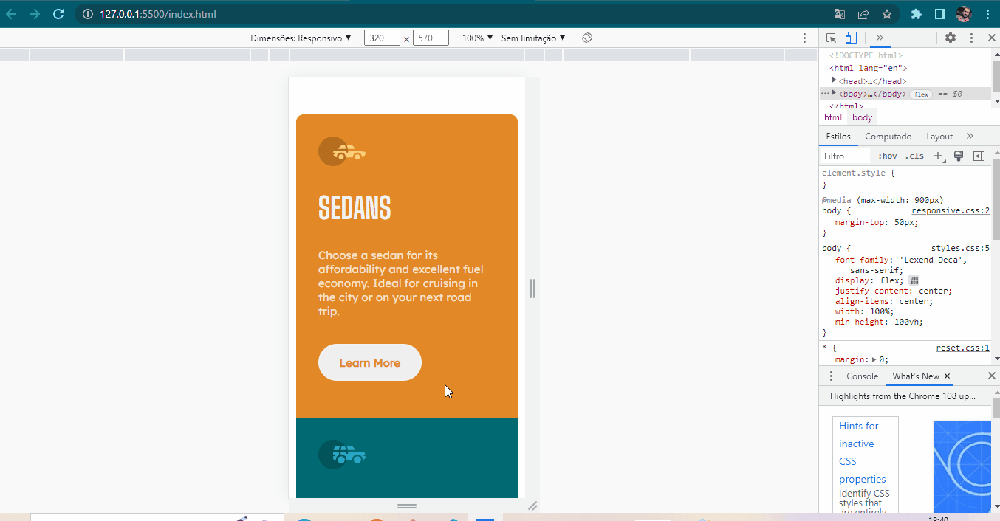

# 3-columns-preview-card-component

Projeto de um card com três colunas.
Usei um diplay: flex; e algumas divs para compô-lo.
 
Nele tive um pouco de trabalho com os buttons para deixá-los com as cores iguais ao sugerido pelo desafio.

No CSS, consegui usar alguns seletores ao mesmo tempo para estilizá-los.

## Tecnologias Ultilizada:

- HTML;
- CSS;

